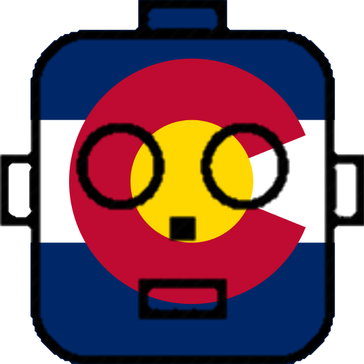

  

    <h1>Welcome to the Colorado Robotics Community</h1>
  

  

    <h3>Community Event Calendar</h3>
    

  

  

    <h3>Recent Events</h3>
    

      
    

    Coloradans having fun with robots
  

  

    <h3 class="text-center">ColoRobo Sponsors</h3>

    

      

        

          

            Boulder Is For Robots
          

        

        

          

          

          
        

      

    

  

